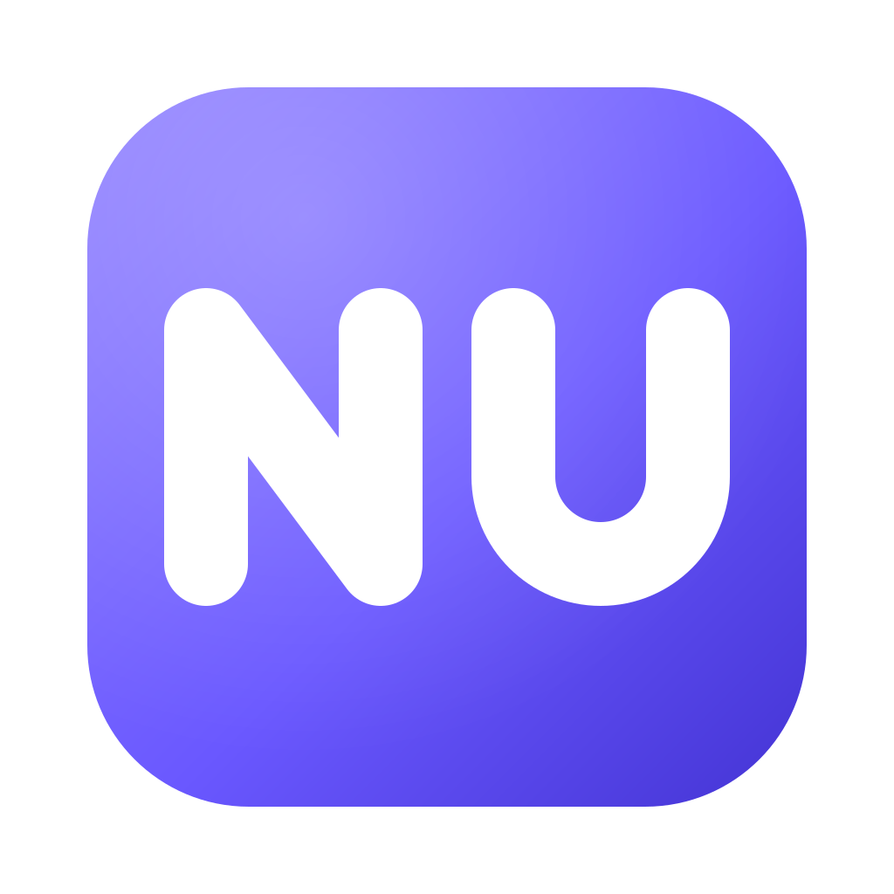
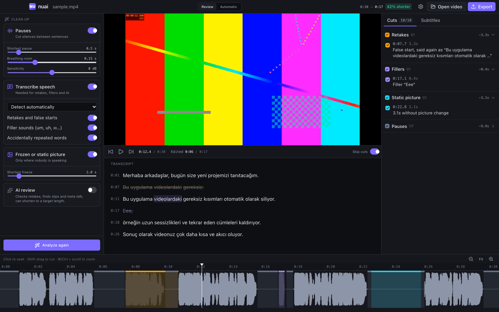
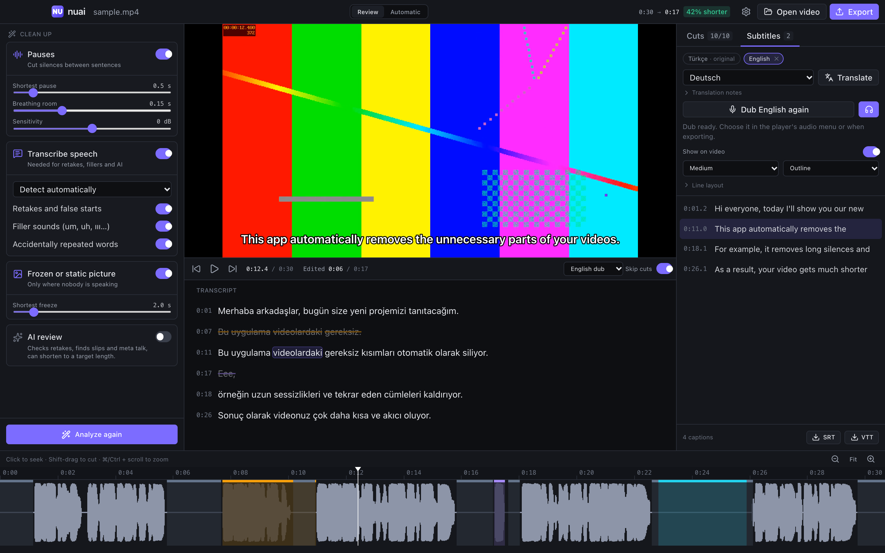
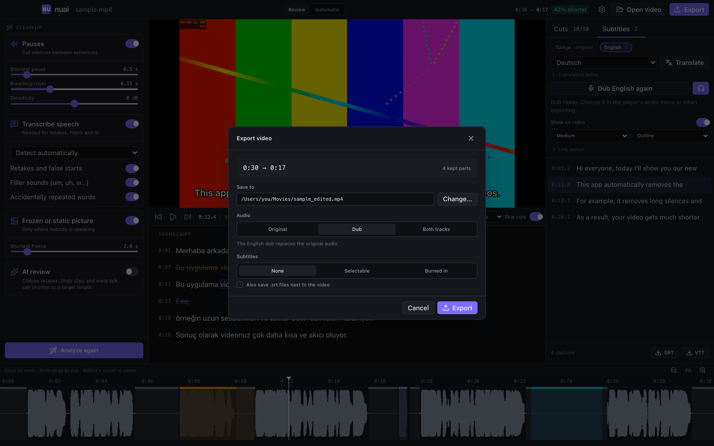

<p align="center">
  
</p>

<h1 align="center">nuai</h1>

<p align="center">
  <b>The open-source AI video editor that cleans up your recordings.</b><br>
  It removes pauses, retakes, filler words and frozen footage, adds subtitles and
  translates them, and can dub the video in the speaker's own voice. Runs on your Mac.
</p>

<p align="center">
  <a href="https://github.com/uceribasi/nuai-video-editor/releases/latest"><b>Download for macOS</b></a> ·
  <a href="#how-it-works">How it works</a> ·
  <a href="docs/ARCHITECTURE.md">Architecture</a> ·
  <a href="#türkçe">Türkçe</a>
</p>

<p align="center">
  
  
  
</p>



## Features

- **Automatic cleanup**: pauses (music in the background doesn't fool it), retakes
  and false starts, filler sounds ("um", "ııı"), accidentally repeated words, and
  stretches where the picture doesn't change.
- **Review or one click**: check every proposed cut on the transcript and timeline,
  cut or keep any words yourself, preview with cuts skipped; or analyze and export in
  one go.
- **Subtitles**: captions from the word-timed transcript that follow your cuts, AI
  translation into other languages, exported as SRT/VTT, selectable tracks or burned
  into the picture.
- **Dubbing in the speaker's voice (beta)**: the voice is cloned from the video itself
  and reads the translated subtitles over the original music and background.
- **Private**: transcription, speech detection and voice cloning run on your computer.
  The optional AI step only ever sees transcript text.
- **Your choice of AI**: your ChatGPT plan through Codex, Claude or OpenAI API keys, or
  a local model with Ollama or LM Studio. Everything except AI review and translation
  works without any AI.
- English and Turkish interface.

## Install

1. Download `nuai_0.1.0_aarch64.dmg` from [Releases](https://github.com/uceribasi/nuai-video-editor/releases/latest), open it
   and drag **nuai** into Applications.
2. Install ffmpeg with [Homebrew](https://brew.sh): `brew install ffmpeg`.
3. nuai isn't notarized by Apple yet, so macOS blocks the first launch. Open it once,
   then go to **System Settings → Privacy & Security**, scroll down and click
   **Open Anyway**. Alternatively, run this in Terminal:
   `xattr -dr com.apple.quarantine /Applications/nuai.app`
4. In nuai, download a speech model under Settings → Transcription.
   `large-v3-turbo-q5_0` (547 MB) is recommended; any whisper.cpp ggml model works.

The download is for Macs with Apple Silicon (M1 or later) and macOS 11 or newer. On an
Intel Mac, [build it from source](#development). Windows and Linux builds are planned;
the code is cross-platform.

## How it works

The AI never edits video and never invents timestamps. Everything that can be measured
is measured locally; the language model only reads a transcript and answers with the
ids of the phrases to remove. ffmpeg does the cutting.

| What gets removed | How it's found | Needs AI? |
|---|---|---|
| Pauses | Speech detection (Silero VAD), so background music doesn't count as talking; loudness threshold as fallback | No |
| Retakes and false starts | Word-timed transcript (whisper.cpp), phrases that are restarted shortly after | No; AI confirms or rejects |
| Filler sounds | Transcript, multilingual filler list | No |
| Accidental repeats | Repeated word groups inside a phrase | No; AI confirms |
| Frozen / static picture | ffmpeg `freezedetect`, only where nobody is talking | No |
| Slips and meta talk ("sorry, again") | AI review | Yes |
| Shortening to a target length | AI review | Yes |

Cuts land on the quietest audio frame nearby, each kept part gets a few milliseconds
of fade so cuts don't click, and segments are rendered frame-accurately. See
[docs/ARCHITECTURE.md](docs/ARCHITECTURE.md) for details.

## Subtitles

Captions are built from the transcript words that survive your cuts (line length and
lines per caption are adjustable) and are timed for the edited video. You can edit any
caption, preview it on the video, and translate the whole track with your AI provider;
cue ids and timing stay fixed, only the text changes.

Export options:

- **Selectable**: every language becomes a subtitle track in the MP4 (`mov_text`).
- **Burned in**: drawn into the picture exactly as the preview shows (outline or box,
  three sizes). The UI renders each caption to a transparent PNG and ffmpeg overlays
  it, so this works with any ffmpeg build, including ones without libass.
- **Files**: `.srt` per language next to the video, or SRT/VTT from the Subtitles tab.

## Dubbing and voice cloning (beta)

Settings → Voice installs an optional local voice engine with one click (about 4.5 GB:
a private Python made with [uv](https://github.com/astral-sh/uv), PyTorch, and the
[OmniVoice](https://github.com/k2-fsa/OmniVoice) and
[Demucs](https://github.com/adefossez/demucs) models). Everything runs offline.
Downloads resume and are checked against pinned SHA-256 hashes; models already in your
Hugging Face cache are reused instead of downloaded again.

**Dubbing:** translate the subtitles, then press *Dub* in the Subtitles tab. nuai
separates the speaker's voice from the music and noise, takes a clean stretch of the
speaker's own speech from the video as the voice reference, speaks every caption in
the new language with that voice, fitted to the caption's timing, and lays it over the
original background. Preview it with the player's audio menu; on export, replace the
original audio or add the dub as an extra audio track.

Only clone voices you own or have permission to use; the app asks you to confirm this
before it clones anything.





Coming next: fixing words by editing the transcript, re-spoken in the same voice.

## AI providers

| Provider | Auth | Notes |
|---|---|---|
| Codex (ChatGPT plan) | Your own `codex` CLI or the Codex app, signed in with your ChatGPT account | No API key; usage counts against your ChatGPT plan. nuai uses the newest Codex it finds, since newer clients get newer models; the list comes from your account |
| Claude | Anthropic API key | Default model `claude-opus-5-5`, pick any from the list |
| OpenAI | OpenAI API key | Responses API with structured outputs |
| OpenAI-compatible | Optional key | Ollama, LM Studio, OpenRouter, Gemini, vLLM… |

API keys are stored in the system keychain. Only transcript text is sent to the
provider, never audio or video.

Claude Pro/Max subscriptions are not supported: Anthropic does not allow third-party
apps to use claude.ai sign-in or plan limits without prior approval, so Claude is
available with an API key.

## Development

You need Rust (stable), Node.js 22.12+, pnpm, cmake and ffmpeg.

```bash
pnpm install
pnpm tauri dev
```

UI-only work without the Rust backend: `pnpm dev` and open http://localhost:1420 in a
browser. It runs against recorded sample data (see `src/dev/mock.ts`):

```bash
scripts/make-test-video.sh public/dev/sample.mp4
cd src-tauri && cargo run --example cli -- ../public/dev/sample.mp4 --lang tr --static --dump ../public/dev/sample.json
```

Build a standalone app (`.app` and `.dmg` under `src-tauri/target/release/bundle/`):

```bash
pnpm tauri build
```

Builds made on your own Mac open without the Gatekeeper prompt.

Tests and lints:

```bash
cd src-tauri && cargo test && cargo clippy --all-targets
pnpm typecheck
```

### Headless CLI

The same pipeline runs without the UI:

```bash
cd src-tauri
cargo run --release --example cli -- talk.mp4 --lang tr --static --export talk_edited.mp4
cargo run --release --example cli -- talk.mp4 --ai --provider codex
cargo run --release --example cli -- talk.mp4 --translate en,de --srt talk.srt --export talk_edited.mp4
```

## Project layout

```
src/                 React + TypeScript UI (Tailwind, zustand, i18next: English, Turkish)
src-tauri/src/
  pipeline.rs        analysis pipeline: audio → silences → transcript → rules → visual → AI
  audio.rs           loudness envelope, silence detection, waveform
  vad.rs             speech detection (Silero VAD, bundled)
  transcribe.rs      whisper.cpp via whisper-rs (DTW word timing, Metal on macOS)
  speech.rs          phrases, retakes, stutters, fillers
  edit.rs            cut list, merging, kept segments
  ai/                Anthropic, OpenAI, OpenAI-compatible, Codex CLI; review and translation
  subtitles.rs       captions from words, line wrapping, edited-timeline mapping, SRT/VTT
  render.rs          frame-accurate export with ffmpeg, subtitle and audio tracks, burn-in
  voice.rs           voice engine installer and worker process
  dub.rs             voice separation, reference picking, dubbed track assembly
  media.rs           ffprobe/ffmpeg helpers, preview proxies, freeze detection
  commands.rs        Tauri commands
scripts/             test-video generator
```

## Roadmap

- "Sign in with ChatGPT" (OAuth) as an alternative to the Codex CLI
- Windows and Linux packages with bundled ffmpeg
- Chat-style editing ("cut the part about pricing")
- Speeding up static stretches instead of cutting them
- Multiple clips, subtitles, export to editing apps

## Contributing

Bug reports, ideas and pull requests are welcome; see
[CONTRIBUTING.md](CONTRIBUTING.md).

## License

MIT, see [LICENSE](LICENSE).

nuai builds on these projects, each under its own license:

- [whisper.cpp](https://github.com/ggml-org/whisper.cpp) (MIT), linked through
  [whisper-rs](https://github.com/tazz4843/whisper-rs), for transcription.
- [Silero VAD](https://github.com/snakers4/silero-vad) (MIT) for speech detection; the
  model file is bundled, see `src-tauri/resources/vad/LICENSE-silero-vad`.
- [ffmpeg](https://ffmpeg.org), run as a separate program, not bundled.
- The optional voice engine, downloaded only when you install it from Settings and not
  part of this repository: [OmniVoice](https://github.com/k2-fsa/OmniVoice)
  (Apache-2.0) and [Demucs](https://github.com/adefossez/demucs) (MIT), with PyTorch.
  Check the model pages on Hugging Face for the terms of their weights.

---

## Türkçe

nuai, kayıtlarını senin yerine temizleyen açık kaynak bir masaüstü video editörüdür.
Duraklamaları, yarım bırakılan tekrar çekimleri, dolgu kelimelerini ("ııı", "eee"),
yanlışlıkla tekrarlanan kelimeleri ve donmuş görüntüleri kaldırıp derli toplu bir MP4
çıkarır. Analiz bilgisayarında çalışır; AI incelemesi isteğe bağlıdır ve API anahtarıyla
(Claude, OpenAI, Ollama gibi OpenAI uyumlu sunucular) ya da Codex CLI üzerinden ChatGPT
planınla kullanılabilir. İnceleme modunda kesimleri tek tek onaylarsın, otomatik modda
tek tıkla analiz edip dışa aktarırsın. Whisper transkriptinden kesimlere uyan altyazılar
oluşturur, AI ile başka dillere çevirir; altyazıları SRT/VTT, videoda seçilebilir iz ya da
görüntüye yazılı olarak dışa aktarır. İsteğe bağlı yerel ses motoruyla videodaki
konuşmacının kendi sesini klonlayıp çevrilmiş altyazıları o sesle seslendirir (dublaj);
müzik ve arka plan sesi korunur.

**Kurulum:** [Releases](https://github.com/uceribasi/nuai-video-editor/releases/latest) sayfasından `.dmg` dosyasını indir, nuai'yi
Uygulamalar'a sürükle ve `brew install ffmpeg` ile ffmpeg'i kur. Uygulama henüz Apple
tarafından onaylanmadığı için macOS ilk açılışı engeller: bir kez açmayı dene, sonra
**Sistem Ayarları → Gizlilik ve Güvenlik** bölümünde **Yine de Aç**'a tıkla. Ardından
Ayarlar → Yazıya dökme bölümünden bir konuşma modeli indir. Apple Silicon (M1 ve sonrası)
ve macOS 11+ gerekir.
